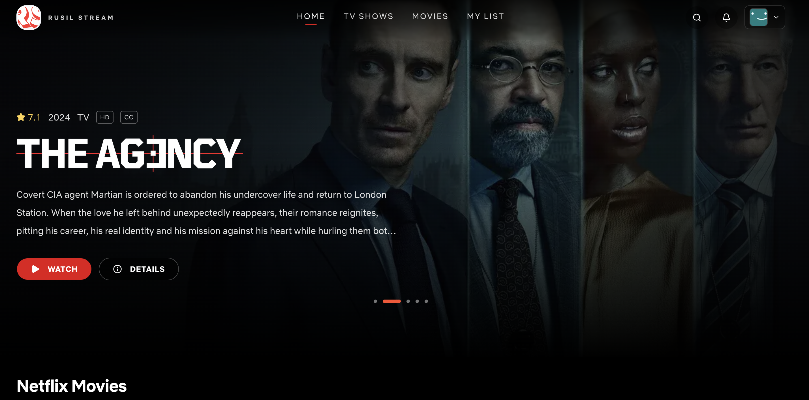

# Rusil Stream

Rusil Stream is a multi-platform streaming project built mainly to practice full-stack development. The idea was to create something that feels close to a real movie/TV platform, where users can browse content, watch trailers or streams, and switch between web, mobile, and TV apps.

This project is still more of a learning/portfolio project than a production-ready app, but the structure is setup in a way that makes it easy to extend.

## Screenshots



## Project Overview

The repo contains three main parts:

- **web-app**: the main web interface and frontend for the platform
- **mobile**: Expo-based mobile app for Android/iOS
- **tv**: React Native TV app for Android TV / smart TV use cases

The app is built around movie and TV content from external APIs, with the frontend designed to feel close to a modern streaming service.

## What this project does

- Browse movies and TV shows
- View details for each title
- Watch content through streaming flows
- Use a clean dark UI inspired by modern streaming platforms
- Support multiple platforms from one codebase idea

## How the app flows

1. The user opens the web app and browses content.
2. The app fetches movie/show data from external APIs.
3. The user can open a player page to stream the selected content.
4. The mobile and TV apps use the same general product idea and connect to the same backend flow.


## Folder Structure

```bash
/
├── web-app/   # Next.js web app
├── mobile/    # Expo React Native mobile app
├── tv/        # React Native TV app
└── APKS/      # Built APK files / testing artifacts
```

## Tech Stack

### Web App
- Next.js
- TypeScript
- Tailwind CSS
- Clerk / auth setup
- MongoDB related backend logic
- Resend email integration

### Mobile App
- Expo
- React Native
- TypeScript
- NativeWind / styling

### TV App
- React Native TV
- TypeScript

### External APIs
- TMDB for movie/show data
- Mapplee / stream-related APIs for playback flow

## Architecture Idea

The project is split by platform, but the overall flow is simple:

- Web app handles the main product UI.
- Mobile app mirrors the same experience for phones.
- TV app focuses on a large-screen streaming experience.
- Shared business logic and API calls are kept as close as possible to the platform-specific frontend needs.

## AI Usage Note

I used AI help for some parts of the project, especially for:

- improving code structure and debugging
- generating UI ideas and component patterns
- helping with documentation and README writing
- understanding some setup/config issues

But the main idea, system design, app flow, and overall project structure were built by me. The core logic and product direction were not copied from anywhere else.

## Why I built this

This project was mainly a learning experience. It helped me understand how a multi-platform product works, how frontend and backend pieces connect, and how different apps can share the same product idea while still feeling native to their platform.

## Getting Started

Each app has its own setup instructions, but the general idea is:

1. Install dependencies for the app you want to run
2. Set up the required environment variables
3. Start the dev server
4. Open the app locally and test the flow

## Notes

- This is a learning project first
- The app is not fully polished like a commercial streaming service yet
- The goal was to practice building a real product flow end to end

